# Diagrama de Clases — PetCare Manager (Fase 6)

Diagrama de clases de la versión final, incluyendo las **entidades del dominio**, la
**capa de acceso a datos**, los **repositorios** y la **interfaz gráfica**.

> El proyecto está organizado en capas:
> - **Models** → entidades del dominio.
> - **Data** → conexión y creación de la base de datos.
> - **Repositories** → acceso a datos (CRUD) bajo el contrato `IRepository<T>`.
> - **GUI** → `Form1` y el punto de arranque `Program`.

---

## 1. Versión Mermaid

```mermaid
classDiagram
    direction TB

    %% ===================== DOMINIO (Models) =====================
    class Animal {
        -int id
        -string nombre
        -string especie
        -string estado
        -DateTime fechaIngreso
        +int Id
        +string Nombre
        +string Especie
        +string Estado
        +DateTime FechaIngreso
        +Animal(id, nombre, especie)
        +Animal(id, nombre, especie, estado, fechaIngreso)
        +ActualizarEstado(string) void
        +EsAdoptable() bool
    }

    class Adoptante {
        -int id
        -string nombre
        -string telefono
        +int Id
        +string Nombre
        +string Telefono
        +Adoptante(id, nombre, telefono)
    }

    class Adopcion {
        +int Id
        +Animal Animal
        +Adoptante Adoptante
        +DateTime FechaSolicitud
        +EstadoAdopcion Estado
        +Adopcion(id, animal, adoptante)
        +Adopcion(id, animal, adoptante, fecha, estado)
        +Aprobar() void
        +Rechazar() void
    }

    class RegistroMedico {
        +int Id
        +DateTime Fecha
        +string Diagnostico
        +string Tratamiento
        +Animal Animal
        +RegistroMedico(id, animal, diagnostico, tratamiento)
        +RegistroMedico(id, animal, diagnostico, tratamiento, fecha)
    }

    class EstadoAdopcion {
        <<enumeration>>
        EN_REVISION
        APROBADA
        RECHAZADA
    }

    %% ===================== DATA =====================
    class IConnectionFactory {
        <<interface>>
        +CreateConnection() SqliteConnection
    }

    class SqliteConnectionFactory {
        -string _connectionString
        +SqliteConnectionFactory(rutaBaseDatos)
        +CreateConnection() SqliteConnection
    }

    class DatabaseInitializer {
        -IConnectionFactory _connectionFactory
        +DatabaseInitializer(IConnectionFactory)
        +Inicializar() void
    }

    %% ===================== REPOSITORIES =====================
    class IRepository~T~ {
        <<interface>>
        +Agregar(T) void
        +ObtenerPorId(int) T
        +ObtenerTodos() IReadOnlyList~T~
        +Actualizar(T) void
        +Eliminar(int) void
    }

    class DataAccessException {
        +DataAccessException(mensaje, innerException)
    }

    class AnimalRepository {
        -IConnectionFactory _connectionFactory
        +Agregar(Animal) void
        +ObtenerPorId(int) Animal
        +ObtenerTodos() IReadOnlyList~Animal~
        +Actualizar(Animal) void
        +Eliminar(int) void
    }

    class AdoptanteRepository {
        -IConnectionFactory _connectionFactory
        +Agregar(Adoptante) void
        +ObtenerPorId(int) Adoptante
        +ObtenerTodos() IReadOnlyList~Adoptante~
        +Actualizar(Adoptante) void
        +Eliminar(int) void
    }

    class AdopcionRepository {
        -IConnectionFactory _connectionFactory
        -IRepository~Animal~ _animalRepository
        -IRepository~Adoptante~ _adoptanteRepository
        +Agregar(Adopcion) void
        +ObtenerPorId(int) Adopcion
        +ObtenerTodos() IReadOnlyList~Adopcion~
        +Actualizar(Adopcion) void
        +Eliminar(int) void
    }

    class RegistroMedicoRepository {
        -IConnectionFactory _connectionFactory
        -IRepository~Animal~ _animalRepository
        +Agregar(RegistroMedico) void
        +ObtenerPorId(int) RegistroMedico
        +ObtenerTodos() IReadOnlyList~RegistroMedico~
        +Actualizar(RegistroMedico) void
        +Eliminar(int) void
    }

    %% ===================== GUI =====================
    class Form1 {
        -IRepository~Animal~ _animales
        -IRepository~Adoptante~ _adoptantes
        -IRepository~Adopcion~ _adopciones
        -IRepository~RegistroMedico~ _registros
        +Form1(animales, adoptantes, adopciones, registros)
    }

    class Program {
        +Main() void
    }

    %% ===================== RELACIONES =====================
    %% Realizaciones (implements)
    SqliteConnectionFactory ..|> IConnectionFactory
    AnimalRepository ..|> IRepository
    AdoptanteRepository ..|> IRepository
    AdopcionRepository ..|> IRepository
    RegistroMedicoRepository ..|> IRepository

    %% Herencia
    DataAccessException --|> Exception

    %% Dependencias capa de datos
    DatabaseInitializer ..> IConnectionFactory
    AnimalRepository ..> IConnectionFactory
    AdoptanteRepository ..> IConnectionFactory
    AdopcionRepository ..> IConnectionFactory
    RegistroMedicoRepository ..> IConnectionFactory

    %% Composición de repositorios
    AdopcionRepository ..> IRepository : usa Animal y Adoptante
    RegistroMedicoRepository ..> IRepository : usa Animal

    %% Asociaciones del dominio
    Adopcion --> Animal
    Adopcion --> Adoptante
    Adopcion --> EstadoAdopcion
    RegistroMedico --> Animal

    %% Errores lanzados por los repositorios
    AnimalRepository ..> DataAccessException
    AdoptanteRepository ..> DataAccessException
    AdopcionRepository ..> DataAccessException
    RegistroMedicoRepository ..> DataAccessException

    %% GUI y arranque
    Form1 ..> IRepository
    Program ..> Form1
    Program ..> SqliteConnectionFactory
    Program ..> DatabaseInitializer
    Program ..> AnimalRepository
    Program ..> AdoptanteRepository
    Program ..> AdopcionRepository
    Program ..> RegistroMedicoRepository
```



---

## 2. Versión PlantUML (alternativa)

```plantuml
@startuml PetCareManager

' ===================== DOMINIO =====================
class Animal {
  - id : int
  - nombre : string
  - especie : string
  - estado : string
  - fechaIngreso : DateTime
  + Id : int
  + Nombre : string
  + Especie : string
  + Estado : string
  + FechaIngreso : DateTime
  + Animal(id, nombre, especie)
  + Animal(id, nombre, especie, estado, fechaIngreso)
  + ActualizarEstado(nuevoEstado : string) : void
  + EsAdoptable() : bool
}

class Adoptante {
  + Id : int
  + Nombre : string
  + Telefono : string
  + Adoptante(id, nombre, telefono)
}

class Adopcion {
  + Id : int
  + Animal : Animal
  + Adoptante : Adoptante
  + FechaSolicitud : DateTime
  + Estado : EstadoAdopcion
  + Adopcion(id, animal, adoptante)
  + Adopcion(id, animal, adoptante, fecha, estado)
  + Aprobar() : void
  + Rechazar() : void
}

class RegistroMedico {
  + Id : int
  + Fecha : DateTime
  + Diagnostico : string
  + Tratamiento : string
  + Animal : Animal
  + RegistroMedico(id, animal, diagnostico, tratamiento)
  + RegistroMedico(id, animal, diagnostico, tratamiento, fecha)
}

enum EstadoAdopcion {
  EN_REVISION
  APROBADA
  RECHAZADA
}

' ===================== DATA =====================
interface IConnectionFactory {
  + CreateConnection() : SqliteConnection
}

class SqliteConnectionFactory {
  - _connectionString : string
  + CreateConnection() : SqliteConnection
}

class DatabaseInitializer {
  - _connectionFactory : IConnectionFactory
  + Inicializar() : void
}

' ===================== REPOSITORIES =====================
interface "IRepository<T>" as IRepository {
  + Agregar(entidad : T) : void
  + ObtenerPorId(id : int) : T
  + ObtenerTodos() : IReadOnlyList<T>
  + Actualizar(entidad : T) : void
  + Eliminar(id : int) : void
}

class DataAccessException

class AnimalRepository {
  - _connectionFactory : IConnectionFactory
}
class AdoptanteRepository {
  - _connectionFactory : IConnectionFactory
}
class AdopcionRepository {
  - _connectionFactory : IConnectionFactory
  - _animalRepository : IRepository<Animal>
  - _adoptanteRepository : IRepository<Adoptante>
}
class RegistroMedicoRepository {
  - _connectionFactory : IConnectionFactory
  - _animalRepository : IRepository<Animal>
}

' ===================== GUI =====================
class Form1 {
  - _animales : IRepository<Animal>
  - _adoptantes : IRepository<Adoptante>
  - _adopciones : IRepository<Adopcion>
  - _registros : IRepository<RegistroMedico>
}

class Program {
  + Main() : void
}

' ===================== RELACIONES =====================
SqliteConnectionFactory ..|> IConnectionFactory
AnimalRepository ..|> IRepository
AdoptanteRepository ..|> IRepository
AdopcionRepository ..|> IRepository
RegistroMedicoRepository ..|> IRepository
Exception <|-- DataAccessException

DatabaseInitializer --> IConnectionFactory
AnimalRepository --> IConnectionFactory
AdoptanteRepository --> IConnectionFactory
AdopcionRepository --> IConnectionFactory
RegistroMedicoRepository --> IConnectionFactory
AdopcionRepository --> IRepository
RegistroMedicoRepository --> IRepository

Adopcion --> Animal
Adopcion --> Adoptante
Adopcion --> EstadoAdopcion
RegistroMedico --> Animal

Form1 --> IRepository
Program ..> Form1
Program ..> SqliteConnectionFactory
Program ..> DatabaseInitializer

@enduml
```



---

## 3. Lectura del diagrama (resumen)

- **Entidades** (`Animal`, `Adoptante`, `Adopcion`, `RegistroMedico`, `EstadoAdopcion`):
  modelan el dominio. `Adopcion` se asocia con `Animal`, `Adoptante` y `EstadoAdopcion`;
  `RegistroMedico` se asocia con `Animal`.
- **`IRepository<T>`**: contrato CRUD genérico. Los cuatro repositorios lo **implementan**
  (relación de realización, línea punteada con triángulo).
- **`IConnectionFactory` / `SqliteConnectionFactory`**: abstracción y conexión concreta a
  SQLite. Todos los repositorios y el inicializador **dependen de la interfaz**, no de la
  clase concreta (Inversión de Dependencias).
- **`AdopcionRepository` y `RegistroMedicoRepository`**: además de la conexión, **reutilizan**
  otros repositorios (`IRepository<Animal>`, `IRepository<Adoptante>`) para reconstruir los
  objetos relacionados.
- **`DataAccessException`**: hereda de `Exception` y es lanzada por todos los repositorios.
- **`Form1`**: depende únicamente de los contratos `IRepository<T>`.
- **`Program`**: es el *Composition Root*; crea las implementaciones concretas y las inyecta.
```
