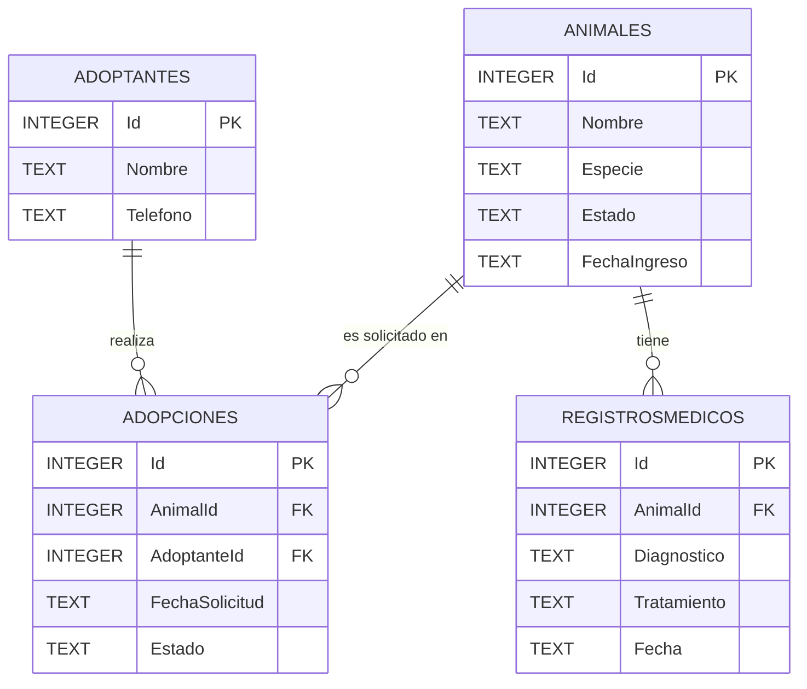

# Informe Final — PetCare Manager (Fase 6)

**Asignatura:** Programación Orientada a Objetos
**Institución:** IU Pascual Bravo
**Proyecto:** Sistema de gestión de un refugio de animales (PetCare Manager)
**Tecnologías:** C# · .NET 8 · Windows Forms · SQLite · ADO.NET

---

## 1. Introducción

PetCare Manager es una aplicación de escritorio para gestionar la información de un
refugio de animales: los **animales** disponibles, las **personas adoptantes**, las
**solicitudes de adopción** y el **historial médico** de cada animal.

En esta fase final el sistema deja de trabajar con objetos en memoria y pasa a
**persistir la información en una base de datos**, con una interfaz gráfica que
permite realizar el ciclo completo de operaciones (crear, consultar, actualizar y
eliminar) sobre cada entidad.

---

## 2. Modelo de base de datos

La base de datos se llama `PetCare.db` y utiliza el motor **SQLite**. Está compuesta
por cuatro tablas que reflejan directamente las entidades del dominio.

### 2.1 Diagrama de tablas (modelo entidad-relación)



### 2.2 Descripción de las tablas

**Tabla `Animales`**

| Columna       | Tipo    | Descripción                                   |
|---------------|---------|-----------------------------------------------|
| `Id`          | INTEGER | Clave primaria. Identificador del animal.     |
| `Nombre`      | TEXT    | Nombre del animal. No nulo.                   |
| `Especie`     | TEXT    | Especie o raza. No nulo.                       |
| `Estado`      | TEXT    | Estado actual (En observación, Disponible, En tratamiento, Adoptado). |
| `FechaIngreso`| TEXT    | Fecha de ingreso al refugio (ISO 8601).       |

**Tabla `Adoptantes`**

| Columna    | Tipo    | Descripción                              |
|------------|---------|------------------------------------------|
| `Id`       | INTEGER | Clave primaria. Cédula del adoptante.    |
| `Nombre`   | TEXT    | Nombre completo. No nulo.                |
| `Telefono` | TEXT    | Teléfono de contacto. No nulo.           |

**Tabla `Adopciones`**

| Columna          | Tipo    | Descripción                                          |
|------------------|---------|------------------------------------------------------|
| `Id`             | INTEGER | Clave primaria. Identificador de la adopción.        |
| `AnimalId`       | INTEGER | Clave foránea → `Animales(Id)`.                      |
| `AdoptanteId`    | INTEGER | Clave foránea → `Adoptantes(Id)`.                    |
| `FechaSolicitud` | TEXT    | Fecha de la solicitud (ISO 8601).                    |
| `Estado`         | TEXT    | Estado de la adopción (EN_REVISION, APROBADA, RECHAZADA). |

**Tabla `RegistrosMedicos`**

| Columna       | Tipo    | Descripción                              |
|---------------|---------|------------------------------------------|
| `Id`          | INTEGER | Clave primaria. Identificador del registro. |
| `AnimalId`    | INTEGER | Clave foránea → `Animales(Id)`.          |
| `Diagnostico` | TEXT    | Diagnóstico del animal. No nulo.         |
| `Tratamiento` | TEXT    | Tratamiento aplicado. No nulo.           |
| `Fecha`       | TEXT    | Fecha del registro (ISO 8601).           |

---

## 3. Justificación de las decisiones de diseño del modelo

1. **Una tabla por entidad del dominio.** Cada clase del modelo de objetos
   (`Animal`, `Adoptante`, `Adopcion`, `RegistroMedico`) se corresponde con una tabla.
   Esto mantiene una relación clara y directa entre el código y la base de datos, y
   facilita el mapeo en los repositorios.

2. **Relaciones mediante claves foráneas.** `Adopciones` y `RegistrosMedicos` no
   duplican los datos del animal o del adoptante: solo guardan su `Id` como clave
   foránea (`AnimalId`, `AdoptanteId`). Así se evita la redundancia y se garantiza la
   integridad referencial: una adopción siempre apunta a un animal y un adoptante que
   existen.

3. **Identificadores provistos por el usuario.** El `Id` del animal y la **cédula**
   del adoptante son identificadores naturales del dominio, por lo que se usan como
   clave primaria en lugar de un autoincremental. Esto coincide con la forma en que
   el usuario los captura en la interfaz.

4. **Fechas y enumeraciones almacenadas como TEXT.** SQLite no tiene un tipo de fecha
   nativo, por lo que las fechas se guardan en formato **ISO 8601** (`yyyy-MM-ddTHH:mm:ss`),
   que es ordenable y reversible. El estado de la adopción (`EstadoAdopcion`) se guarda
   con el nombre del valor del enum (`EN_REVISION`, etc.), lo que hace la base de datos
   legible y fácil de reconstruir con `Enum.Parse`.

5. **Restricciones `NOT NULL`.** Los campos obligatorios se declaran `NOT NULL` en la
   base de datos, reforzando a nivel de almacenamiento las mismas validaciones que ya
   existen en las entidades.

---

## 4. Método de conexión empleado

La aplicación se conecta a la base de datos usando **ADO.NET** a través del paquete
oficial **`Microsoft.Data.Sqlite`**.

### 4.1 ¿Por qué ADO.NET y SQLite?

- **SQLite** guarda toda la base de datos en un único archivo (`PetCare.db`), sin
  necesidad de instalar ni configurar un servidor. Esto hace que el proyecto sea
  **portable**: se entrega y funciona en cualquier computador.
- **ADO.NET** permite escribir el SQL de forma explícita, lo que evidencia con
  claridad las operaciones CRUD y el uso de **consultas parametrizadas** (protección
  contra inyección SQL).

### 4.2 Cadena de conexión y fábrica de conexiones

La conexión se centraliza en una **fábrica** (`SqliteConnectionFactory`) que
implementa la interfaz `IConnectionFactory`. De esta forma, los repositorios no crean
conexiones por su cuenta ni conocen la cadena de conexión:

```csharp
public class SqliteConnectionFactory : IConnectionFactory
{
    private readonly string _connectionString;

    public SqliteConnectionFactory(string rutaBaseDatos)
    {
        _connectionString = $"Data Source={rutaBaseDatos}";
    }

    public SqliteConnection CreateConnection()
    {
        var conexion = new SqliteConnection(_connectionString);
        conexion.Open();
        return conexion;
    }
}
```

### 4.3 Creación automática del esquema

Al iniciar la aplicación, la clase `DatabaseInitializer` crea las tablas si todavía no
existen (`CREATE TABLE IF NOT EXISTS ...`). Así, la primera ejecución en cualquier
equipo genera la base de datos vacía y lista para usarse.

### 4.4 Punto de composición (Composition Root)

Todas las dependencias se construyen **una sola vez** en `Program.cs` y se inyectan
hacia las capas superiores:

```csharp
IConnectionFactory connectionFactory = new SqliteConnectionFactory(rutaBaseDatos);
new DatabaseInitializer(connectionFactory).Inicializar();

IRepository<Animal> animalRepo = new AnimalRepository(connectionFactory);
IRepository<Adoptante> adoptanteRepo = new AdoptanteRepository(connectionFactory);
IRepository<Adopcion> adopcionRepo = new AdopcionRepository(connectionFactory, animalRepo, adoptanteRepo);
IRepository<RegistroMedico> registroRepo = new RegistroMedicoRepository(connectionFactory, animalRepo);

Application.Run(new Form1(animalRepo, adoptanteRepo, adopcionRepo, registroRepo));
```

---

## 5. Ejemplos reales de operaciones CRUD implementadas

Todas las operaciones usan **consultas parametrizadas** (`$parametro`) para evitar
inyección de SQL. Los ejemplos siguientes provienen de `AnimalRepository`.

### 5.1 CREATE — Insertar un animal

```csharp
comando.CommandText = @"
    INSERT INTO Animales (Id, Nombre, Especie, Estado, FechaIngreso)
    VALUES ($id, $nombre, $especie, $estado, $fecha);";
comando.Parameters.AddWithValue("$id", animal.Id);
comando.Parameters.AddWithValue("$nombre", animal.Nombre);
comando.Parameters.AddWithValue("$especie", animal.Especie);
comando.Parameters.AddWithValue("$estado", animal.Estado);
comando.Parameters.AddWithValue("$fecha", animal.FechaIngreso.ToString("o"));
comando.ExecuteNonQuery();
```

### 5.2 READ — Consultar todos los animales

```csharp
comando.CommandText = "SELECT Id, Nombre, Especie, Estado, FechaIngreso FROM Animales ORDER BY Id;";
using SqliteDataReader lector = comando.ExecuteReader();
while (lector.Read())
    animales.Add(Mapear(lector));   // convierte cada fila en un objeto Animal
```

### 5.3 UPDATE — Actualizar un animal existente

```csharp
comando.CommandText = @"
    UPDATE Animales
    SET Nombre = $nombre, Especie = $especie, Estado = $estado
    WHERE Id = $id;";
// ... parámetros ...
int filas = comando.ExecuteNonQuery();
if (filas == 0)
    throw new DataAccessException($"No existe ningún animal con el ID {animal.Id} para actualizar.", ...);
```

### 5.4 DELETE — Eliminar un animal

```csharp
comando.CommandText = "DELETE FROM Animales WHERE Id = $id;";
comando.Parameters.AddWithValue("$id", id);
int filas = comando.ExecuteNonQuery();
```

### 5.5 Reconstrucción de objetos relacionados

`AdopcionRepository` guarda solo los `Id` de animal y adoptante, y al leer reconstruye
los objetos completos reutilizando los otros repositorios:

```csharp
Animal? animal = _animalRepository.ObtenerPorId(animalId);
Adoptante? adoptante = _adoptanteRepository.ObtenerPorId(adoptanteId);
var estado = (EstadoAdopcion)Enum.Parse(typeof(EstadoAdopcion), lector.GetString(4));
return new Adopcion(id, animal, adoptante, fecha, estado);
```

---

## 6. Análisis de los principios SOLID aplicados

### S — Responsabilidad Única (Single Responsibility)
Cada clase tiene una sola razón para cambiar:
- Las **entidades** (`Animal`, `Adoptante`, …) solo modelan datos y reglas del dominio.
- Los **repositorios** solo se encargan del acceso a datos (SQL).
- `SqliteConnectionFactory` solo gestiona la conexión.
- `DatabaseInitializer` solo crea el esquema.
- `Form1` solo coordina la interacción con el usuario.

### O — Abierto/Cerrado (Open/Closed)
El sistema está **abierto a extensión** pero **cerrado a modificación**: para agregar
una nueva entidad basta crear un nuevo repositorio que implemente `IRepository<T>`,
sin tocar el código existente.

### L — Sustitución de Liskov (Liskov Substitution)
Cualquier implementación de `IRepository<T>` puede sustituir a otra sin romper la
aplicación. `Form1` funciona igual con `AnimalRepository` o con cualquier repositorio
alternativo (por ejemplo, uno en memoria para pruebas), porque depende del contrato,
no de la clase concreta.

### I — Segregación de Interfaces (Interface Segregation)
`IRepository<T>` define únicamente las operaciones CRUD que todas las entidades
necesitan, sin métodos sobrantes que obliguen a implementaciones vacías.

### D — Inversión de Dependencias (Dependency Inversion)
Las capas altas dependen de **abstracciones**, no de implementaciones:
- `Form1` depende de `IRepository<T>`, no de los repositorios concretos.
- Los repositorios dependen de `IConnectionFactory`, no de `SqliteConnection`.
- Las dependencias se inyectan por constructor desde el *Composition Root* (`Program.cs`).

> Gracias a esto, si algún día se cambia SQLite por SQL Server o MySQL, solo habría que
> crear una nueva fábrica de conexiones y nuevos repositorios; la interfaz gráfica no
> se modificaría.

---

## 7. Manejo de excepciones y validaciones

El sistema valida en **dos capas**, cumpliendo el principio de defensa en profundidad:

- **Validación desde la GUI:** campos vacíos, IDs que deben ser numéricos, selección
  obligatoria en los combos (método `TryLeerEntero`, comprobaciones previas al guardado).
- **Validación desde la capa lógica:** las entidades lanzan `ArgumentException` cuando
  reciben datos inválidos (por ejemplo, un nombre vacío).
- **Errores de base de datos:** los repositorios capturan `SqliteException` y la
  envuelven en una excepción propia, `DataAccessException`, con un mensaje claro para
  el usuario (por ejemplo, ID duplicado o registro inexistente).

---

## 8. Oportunidades de mejora identificadas

1. **IDs autoincrementales.** Actualmente el usuario debe escribir los identificadores
   de animal, adopción y registro médico. Se podría delegar la generación del `Id` a la
   base de datos (`AUTOINCREMENT`) para evitar errores y duplicados.

2. **Capa de servicios.** Entre la GUI y los repositorios podría añadirse una capa de
   servicios que concentre las reglas de negocio (por ejemplo, impedir adoptar un animal
   que no esté "Disponible"), dejando la GUI aún más liviana.

3. **Borrado en cascada / integridad referencial activa.** Hoy se puede eliminar un
   animal aunque tenga adopciones o registros médicos asociados. Se podrían activar las
   *foreign keys* de SQLite (`PRAGMA foreign_keys = ON`) y definir reglas `ON DELETE`.

4. **Búsqueda y filtros.** Agregar cuadros de búsqueda y filtros en las tablas
   (por nombre, por estado, por fecha) mejoraría el uso con muchos registros.

5. **Pruebas automatizadas.** Como los repositorios dependen de interfaces, se podrían
   escribir pruebas unitarias con una base de datos en memoria para validar el CRUD sin
   intervención manual.

6. **Asincronía.** Para bases de datos grandes o remotas, las operaciones podrían
   volverse asíncronas (`async/await`) para no congelar la interfaz.

---

## 9. Conclusión

PetCare Manager evolucionó de un conjunto de objetos en memoria a una aplicación de
escritorio completa, con persistencia en SQLite, un patrón **Repository** sobre
**ADO.NET**, una interfaz gráfica con CRUD para las cuatro entidades, manejo robusto de
excepciones y validaciones en dos capas. El diseño aplica los principios **SOLID**, lo
que da como resultado un código organizado, mantenible y preparado para crecer.
